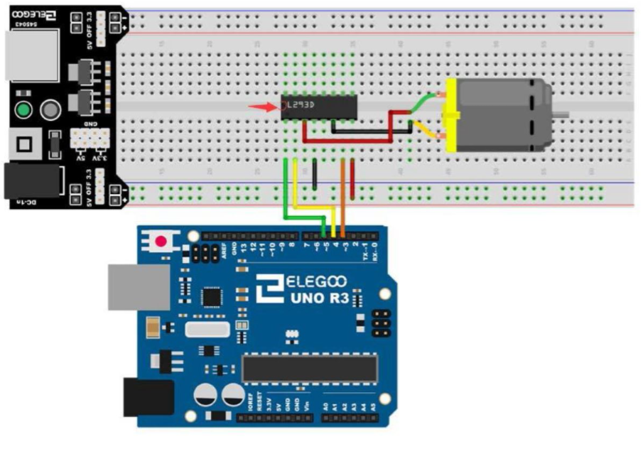
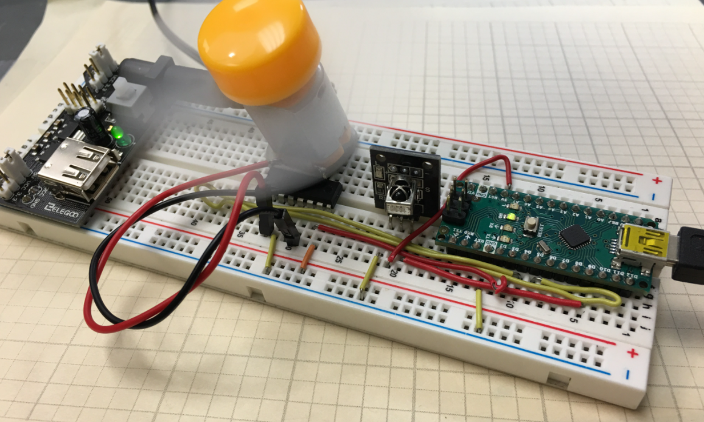

# Arduino DC remote control

In this project I develop a project that allow Remote Control of the speed and direction of a DC Motor. I use an Arduino Nano, and components from the Elegoo Kit.

---

**Components**

* Arduino UNO or Nano
* Breadboard or PCB
* Motor Driver L239 chip
* DC motor from Elegoo kit
* IR remote transceiver from Elegoo kit
* Wires/Jumper Cables

---

**Libraries**

- IRremote.h

---

**Schematic**

    

---

**Process**

The main purpose of this project is to allow Remote Control of the speed and direction of a DC Motor. The initial task is to map button pushes on the Infrared Remote Control to useful functions in the Arduino. The remote control receiver is connected as follows: R on Remote to 5V, G on Remote to Ground, and Y on the Remote to Arduino Digital Pin 9. A Motor Driver L239 Chip is used to drive the DC motor. Its connections can be seen in the schematic.

---

**Circuit**

    

