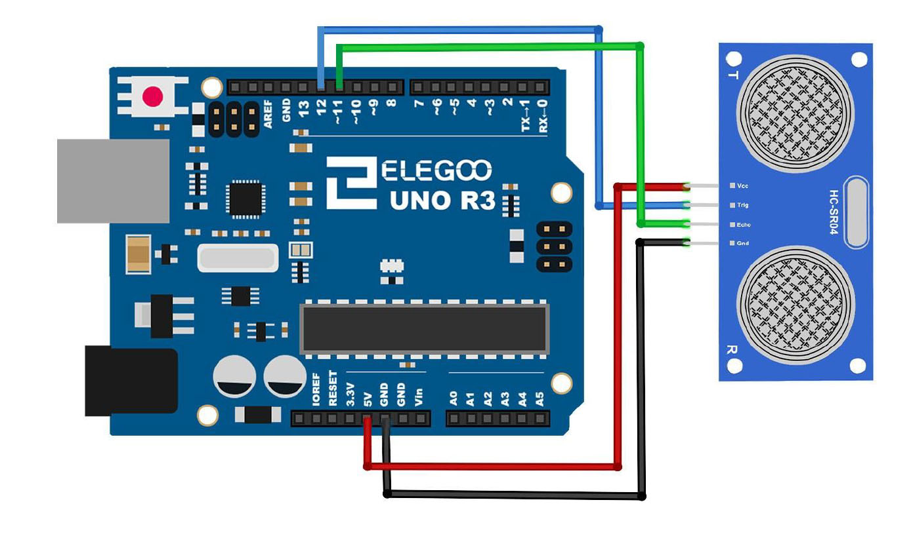
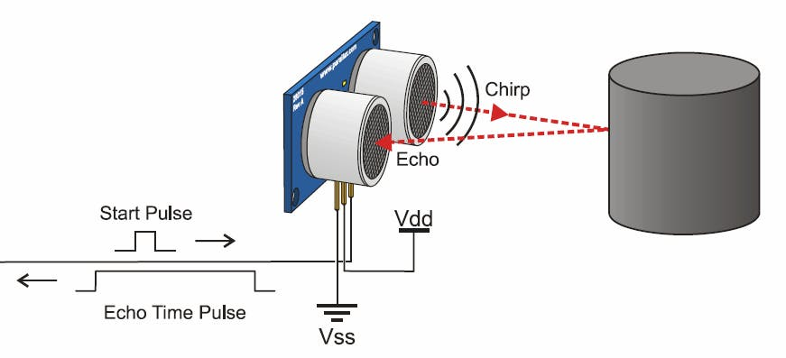
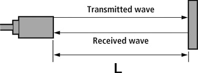
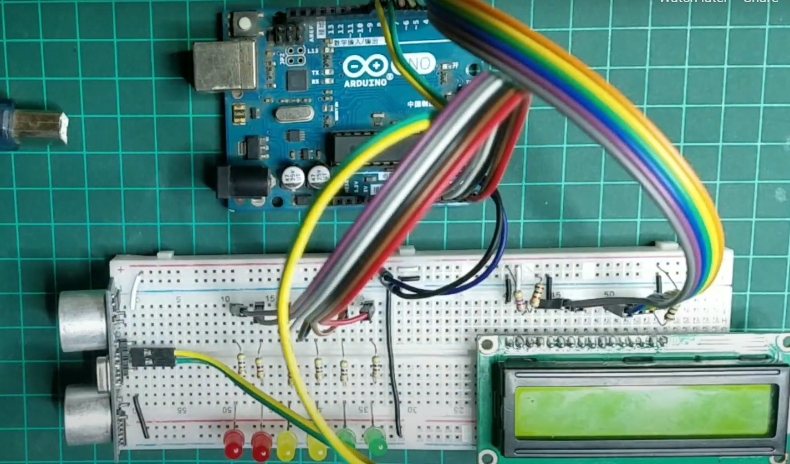

# Arduino Distance measurements

In this project I develop a system that measures distance with an ultrasonic sensor HCSR-04 and prints the results in an LCD screen


---

**Components**

* Arduino UNO or Nano
* Breadboard or PCB
* Ultrasonic distance sensor HCSR04
* Battery 9V
* 5 LEDs
* LCD screen

---

**Libraries**

- LiquidCrystal.h

---

**Schematic**

<p alling = "center">
    
</p>


---

**Protocol of HCSR04**


<p alling = "center">
    
</p>

HSCR04 consists of an emitter and a receiver, which emits and receives ultrasonic waves. We emit a sound wave from the trigPin by sending a 10 usec pulse. As soon as the ultrasound is emitted through the emitter the module makes the echoPin HIGH. Emitted ultrasound travels forward till it gets reflected by object and then it travels backward. The reflected ultrasound is detected by the receiver.

Subsequently, echoPin is set to LOW, when it receives the signal. This process measures the total travelling time to the object and backwards. So basically, we are interested in the half of the measured time.

<p alling = "center">
    
</p>


```
Distance = (Time/2) * Speed
```

---

**Circuit**

<p alling = "center">
    
</p>

