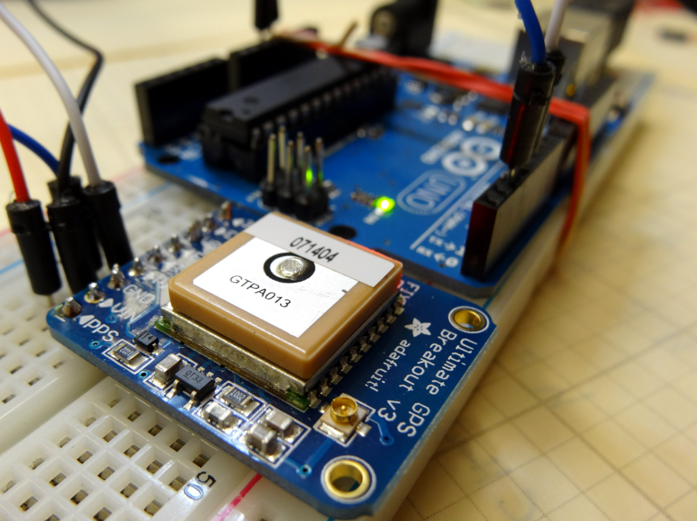

# Arduino-GPS project

A simple project on Arduino to read and print data from a GPS sensor.

In this project we will need the GTPA013 tracker and its library https://github.com/adafruit/Adafruit_GPS

**Circuit**

    

---

**Connections**

| **GPS Pin** | **Arduino Pin** |
| ----------- | --------------- |
| Vin         | 5V              |
| GND         | GND             |
| RX          | Pin 2           |
| TX          | Pin 3           |