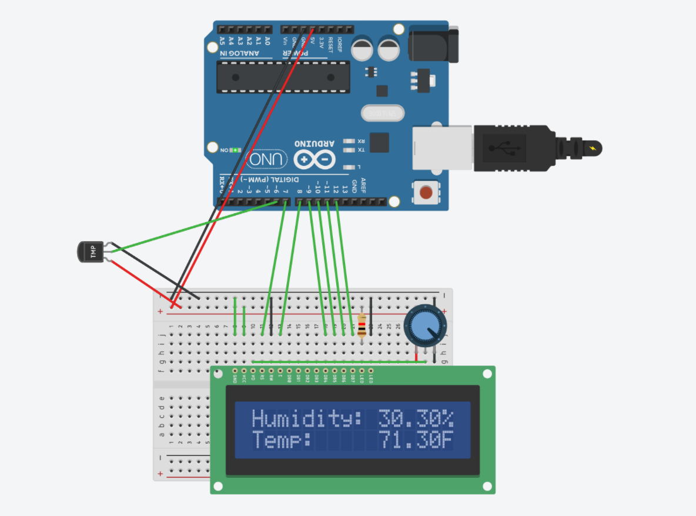

# Measurements of Temperature and Humidity

A simple Arduino project for the measurement of temperature and humidity and their display on an LCD screen

---

**Components**

* Arduino UNO or Nano
* Breadboard or PCB
* LCD Screen (2x16)
* Temperature and Humidity Sensor or Module (DHT11 used here)
* 1000 ohm resistor
* Potentiometer
* Wires/Jumper Cables

---

**Libraries**

- Adafruit DHT library

---

**Schematic**

    

