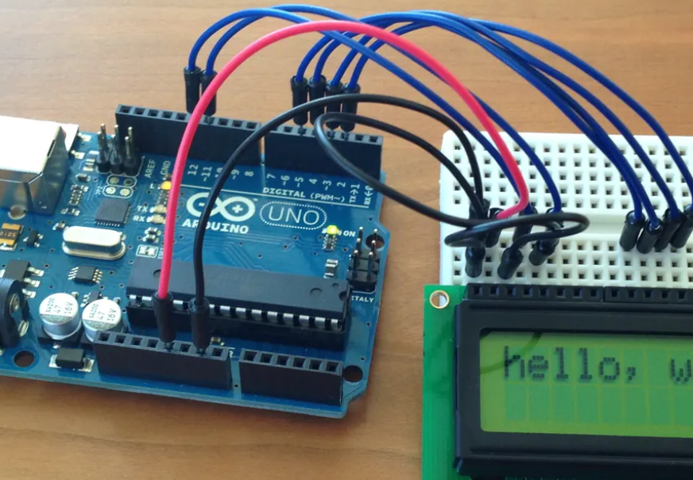

# Arduino Projects

This repository contains some of the projects I have implemented on Arduino board. The main purpose of these projects is the familiarization with data acquisition from sensors and peripherals driving through specific communication protocols. 

---

    

